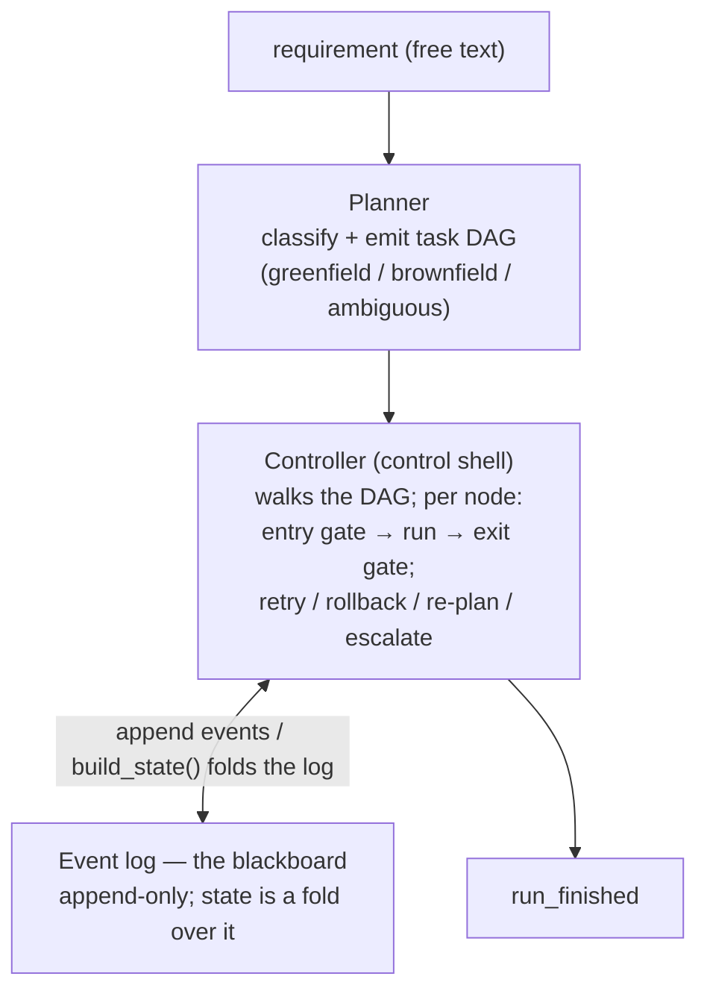
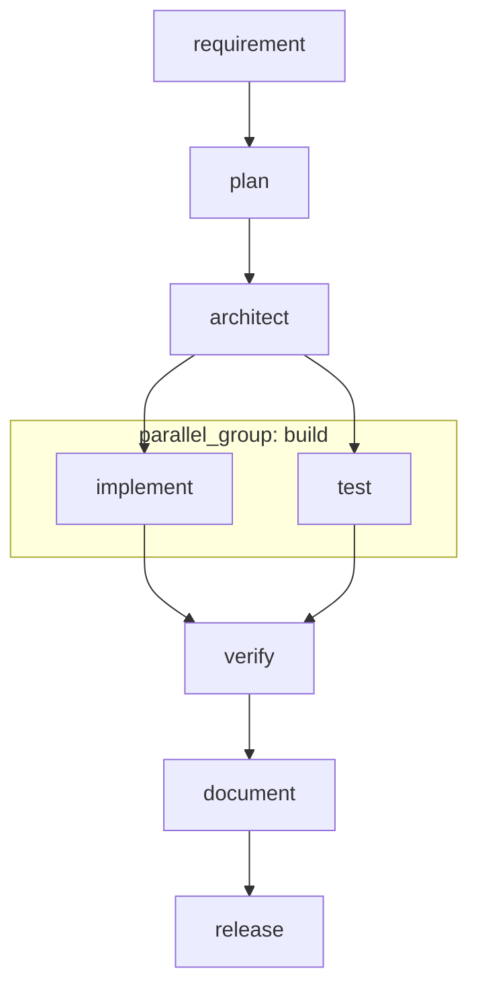

# Agentic SDLC Orchestrator

**An agentic software-engineering system that turns a plain-English requirement into verified, governed engineering output.**

The graded artifact here is the *orchestrator*, not the URL shortener it produces. Given a requirement like `"make a url shortener"`, the system classifies the intent, generates a task graph, runs LLM-backed agents through governed gates, verifies the result against real tests, and produces working code — with human approval on high-impact actions and a full audit trail throughout. The URL shortener is the fixture it happens to build.

---

## What it is

The system is built on a **blackboard architecture with event sourcing**. Specialized LLM-backed agents (the *knowledge sources* — Architect, Implement, Test, Verify, and others) never talk to each other directly; they read from and write to a shared, append-only event log (the *blackboard*). A deterministic controller (the *control shell*) walks a task DAG that is generated per-requirement, deciding which agent runs next from the current state of the board.

Because system state is a projection (a fold) over the immutable event log, one primitive gives you the audit trail, rollback, and reliability metrics — rather than three separate subsystems. LLM judgment is fenced *inside* each node; the control flow around it is deterministic and reproducible.

The orchestrator handles three requirement classes, each producing a genuinely different task graph:

- **Greenfield** — build from scratch (e.g. `"make a url shortener"`)
- **Brownfield** — change existing code, with impact analysis and human approval (e.g. `"add a health endpoint"`)
- **Ambiguous** — a vague request the system refuses to guess, asking the human to resolve it first (e.g. `"make it more reliable"`)

For the full design, component mapping, control flow, and the reasoning behind each decision, see **[ARCHITECTURE.md](ARCHITECTURE.md)**.

---

## Quickstart

Requires Python 3.11+ and an OpenAI API key.

```bash
# 1. Clone and enter the project
git clone https://github.com/chrissharma0011/agentic-sdlc.git
cd agentic-sdlc

# 2. Create and activate a virtual environment
python3 -m venv venv
source venv/bin/activate        # Windows: venv\Scripts\activate

# 3. Install dependencies
pip install -r requirements.txt

# 4. Add your API key
cp .env.example .env
# then edit .env and set OPENAI_API_KEY=sk-...

# 5. Run it
python3 build.py "make a url shortener"
```

`build.py` is the front door: it takes any requirement as free text, classifies it, runs the right pipeline, verifies the output, and saves the generated code to `shortener/app.py`. Each run gets a fresh run id, and a fresh build warns before overwriting existing work.

---

## The three scenarios

The system routes each requirement to a different graph based on its intent. Run each directly through the front door:

**Greenfield — build something new**
```bash
python3 build.py "make a url shortener"
```
Generates a design, contract, implementation, and tests; runs the tests; documents and releases. No existing code is touched.

**Brownfield — change existing code**
```bash
python3 build.py "add a health endpoint to the shortener"
```
Reads the existing `shortener/app.py`, produces an impact analysis of what the change affects, asks change-risk clarifying questions, and pauses for human approval before applying a **targeted in-place patch** (shown as a diff). Existing behavior is verified intact.

**Ambiguous — a vague request**
```bash
python3 build.py "make it more reliable"
```
The system detects the request is under-specified and, rather than guessing, asks the human what it concretely means, then routes to build-or-patch based on whether an app already exists.

Each scenario can also be run through its dedicated module:
```bash
python3 -m scenarios.greenfield
python3 -m scenarios.brownfield
python3 -m scenarios.ambiguous
```

### Human-in-the-loop

Brownfield and ambiguous runs pause at an approval gate with three options:
- `yes` — approve and proceed
- `no` — reject and safe-stop
- `revise` — approve *with feedback* (e.g. "keep it minimal, no extra logging"); the feedback is honored in the resulting patch

---

## Using the generated shortener

The orchestrator produces an API. To actually use it in a browser:

```bash
uvicorn shortener.app:app --reload
```

Then open `http://127.0.0.1:8000`. The API endpoints:

- `POST /shorten` — body `{"long_url": "..."}` → `{"short_code": "..."}`
- `GET /{short_code}` — 307 redirect to the original URL
- `GET /stats/{short_code}` — `{"clicks": N}`

Storage is an in-memory dict, so short codes reset when the server restarts. A small home-page UI is served at `/` as a thin presentation layer on top of the generated API — the orchestrator generates the backend; the UI shell is added for browser demonstration.

---

## Running the tests

The orchestration engine has its own test suite (no API key required — it uses synthetic nodes):

```bash
python3 tests/test_engine.py
```

It verifies the parts that matter most: concurrent fork-join execution, dynamic re-planning on failure, and the closed human-approval loop. The generated shortener's own tests live in `shortener/test_app.py` and are executed automatically by the Verify node during every run.

---

## Architecture at a glance



The **greenfield** task graph (nodes run when dependencies are met; `implement` and `test` run in parallel and synchronize at `verify`):



Full detail — component mapping, the governed node lifecycle, the three DAGs, the recovery model, the contract chain, and the key architecture decisions (as ADRs) — is in **[ARCHITECTURE.md](ARCHITECTURE.md)**.

---

## Project structure

```
build.py              Front door: requirement in → verified code out
run.py                Wires the graph + nodes and runs the controller
core/
  planner.py          Classifies the requirement; builds the per-class DAG
  graph.py            The task DAG (dependencies, status, parallel groups)
  controller.py       The control shell: walks the graph, recovery, re-planning
  node.py             The governed node lifecycle (entry gate → run → exit gate)
  event_log.py        Append-only event log; build_state() folds it into state
  metrics.py          Reliability metrics computed from the log
  policy.py           Cross-cutting guardrails enforced at gates
  replanner.py        Escalation package + human decision prompt
  overwrite_guard.py  Warns before a fresh build overwrites existing work
nodes/
  agents.py           The LLM-backed knowledge sources + the contract
  human_gates.py      Clarify and three-way approval nodes
  patcher.py          Surgical in-place patching for brownfield changes
  llm.py              The single LLM call point
scenarios/            Runnable greenfield / brownfield / ambiguous scenarios
shortener/            The generated fixture (URL shortener) + its tests
tests/                Engine test suite
demos/                Standalone demos
```

---

## Future scope

The system is designed so that each of these extends the existing architecture rather than replacing it — the event-sourced spine, the gate model, and the deterministic control shell all carry forward unchanged.

- **Database-backed durable state.** Runs already persist to an append-only event log (`runs/<run_id>/events.jsonl`) with full crash-recovery resume. The next step is backing that log with a database (e.g. Postgres), giving concurrent-run isolation, queryable run history, and durable state for long-running or distributed execution. Because state is already a fold over the log, this is a storage swap, not a redesign.
- **LLM-based intent classification.** The planner currently classifies requirements deterministically; upgrading to an LLM classifier generalizes intent detection to arbitrary phrasings while keeping the same three-way routing (greenfield / brownfield / ambiguous) and the same downstream graphs.
- **Hardened policy guardrails.** The guardrail layer is enforced at gates and is designed to be extended: richer policies (dependency-license checks, static-analysis passes, style/security linting) plug in as additional gate checks without touching node logic.
- **Expanded secret and PII scanning.** The no-secrets guardrail can be upgraded from pattern matching to a full detection layer (entropy analysis, named detectors, format-preserving redaction), enforced at the same gate boundary so nothing bypasses it.
- **Multi-project workspaces.** Changes currently target the working tree; project-scoped storage keyed above the run id would let the orchestrator manage multiple codebases concurrently, each with its own event log and history.
- **CI integration.** The engine and fixture test suites are ready to wire into a CI workflow (run on every push), turning the verification layer into a continuous gate.

---

## Requirements

See `requirements.txt`. Core dependencies: `fastapi`, `uvicorn`, `pydantic`, `openai`, `python-dotenv`, `pytest`, `httpx`.
